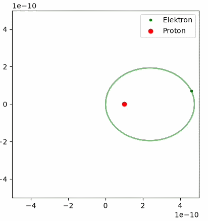

# electromagnetic-particle-simulation

Dieses Projekt ist eine numerische Simulation eines klassischen Elektron–Proton-Systems unter dem Einfluss der Coulomb-Kraft sowie der Lorentzkraft in einem externen Magnetfeld. Die Bewegung der geladenen Teilchen wird zeitlich diskret berechnet und in Echtzeit visualisiert.

Ziel der Simulation ist es, die dynamische Wechselwirkung zwischen elektrischen und magnetischen Kräften anschaulich darzustellen und die resultierenden Trajektorien beider Teilchen zu untersuchen. Zusätzlich ermöglicht ein interaktiver Slider die Veränderung der Magnetfeldstärke während der Simulation.

Das Projekt verbindet Grundlagen der klassischen Elektrodynamik mit numerischen Integrationsverfahren und bietet eine visuelle Darstellung physikalischer Teilchendynamik.

